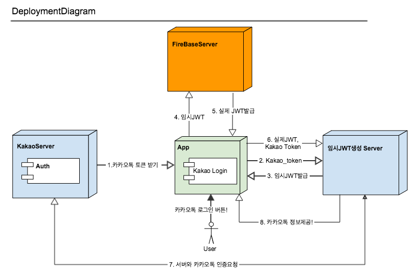

# Swift FireBase 이용하여 카카오톡 로그인하기.

> Date: 2018.4.18<br>
> Language: Swift 3.3

 앱에서 카카오톡을 이용하여 Firebase에 연동하고 싶을때 내가한 경험들을 작성해 놓으려고한다. 서버와의 통신을 위해 NSURLSession을 활용한다. ~~그러면 NSURLSession을 어떻게 쓰는지 알아보자.~~

<br>
카카오톡로그인 과정을 다음 그림을 통해 알아보자. 처음에 이과정을 이해하는데 약간의 시간이 걸렸다...
카카오톡로그인과 FireBase 커스텀 토큰을 활용한 예제가 없다보니, 특히 Swift는 더욱 없었다.



일단 FireBase의 Custom Token을 이용하여 사용자 정보를 등록하고 관리한다. 순서에 따른 설명으로 왜 이렇게 구현하게 되었는지 간략한 설명을 추가할 예정이다.

-----
## 로그인 로직
1. 카카오톡으로부터 토큰을 받아온다.
```swift
    @IBAction func kakaoLogin(_ sender: UIButton) {
        guard let session = KOSession.shared() else { return }
        if session.isOpen() { session.close() }        
        session.open { (error) in
            if session.isOpen() {
                KakaoTokenRequset().requestKakao(accessToken: session.accessToken)
            } else {
                self.kakaoLoginFail(error: error!)
            }
        }
    }
```
**코드1. 카카오톡으로 부터 토큰을 받아오는 코드**

```KOSession```이 객체(KakaoSDK를 프로젝트에 추가하면 생기는 객체.. 카카오 라이브러리를 추가하는 방법은 다른 글에서 자세히 나와있으니 검색하셔서 참고하시면됩니다.)를 이용하여 Session을 열어 Kakao Token을 받아온다. ```session.accessToken``` FaceBook은 친절하게 Firebase와 연동하여 로그인시스템을 구축하려할때 자체적으로 JWT를 생성하는 SDK가있다. ```FBSDKLoginManager``` 이 친구가 FireBase용 JWT를 만들어서 자연스럽게 사용하여 로그인 요청을 하면된다. 하지만 우리의 카카오톡은 (18.4.18일 기준) Firebase와 연결해주는 그런것 없다. 그져 Token값으로 ```String```만내려준다. 

그래서 우리가 임의로 JWT를 만들어줘야한다. ([FireBaseCustom Token 예제](https://github.com/firebase/custom-auth-samples/tree/master/kakao)에서도 그렇게 이야기한다.)
그래서 위의 그림에 **임시JWT생성 Server**라는게 존재한다.이친구는 받은 객체를 가지고 임시 JWT를 만들어준다. 

------

2. 임시JWT생성 Server에 받은 Kakao_token넘겨주기.
```swift
    static func requestKakao(accessToken: String) {
        var parameters = HttpManager.sharedInstance().getKakaoUrl()
        parameters.append(accessToken)
        guard let url = URL(string: parameters) else { return }
        var urlRequest = URLRequest(url: url)
        urlRequest.httpMethod = "GET"
        
        URLSession.shared.dataTask(with: urlRequest) { (data, response, error) in
            guard let data = data, error == nil else { return }
            let kakaoLoginData = try? JSONDecoder().decode(KakaoDataModel.self, from: data)
            guard let accessData = kakaoLoginData?.data.first else { return }
            self.requestSigninFIR(accessToken: accessData.token, kakaoToken: accessData.kakao_token)
        }.resume()
    }
```
**코드2. 서버에 Kakao_token넘겨주기 URLSession을 이용해 보았다.**

위의 코드에서 ```HttpManager.sharedInstance().getKakaoUrl()```여기에는 우리측 서버 URL을 넣어주면된다. 여기서예제와 같은 경우에는 GET으로 서버에 카카오토큰을 추가해서 넘겨주고있다. 보통 이런 방법을 찾고있는 사람이라면 URLSession사용법도 익숙치 않은걸로 생각이든다.(왜냐하면 나또한 이거하면서 조금 익혔기 때문이다.) 무튼 위와 같은 형식으로 GET으로 세팅을 하고 ```URLSession.shared.dataTask(with: urlRequest)```을 요청한다. 이렇게되면, 위의 함수는 클로져이기때문에 호출 함수가 끝난뒤에 다시 호출이된다.resume때문.. (이부분은 아직 확실하지 않은 부분이다. 단지 동작을 그렇게해서 이렇게 이해를 했다. 자세한건 더 찾아봐야한다..) <br>

------

3. 서버에서 임시 JWT를 내려준다.
그래서 서버와의 연결 후 data로 부터 ```KakaoDataModel```(JSON형태)을 파싱하여 나의 객체에 저장한다. 여기에 임시 JWT가 서버에서 만들어줘서 들어있다. 

------
4. 카카오톡JWT를 실제 FireBase에 요청한다.
임시 JWT는 카카오톡 토큰을 가진 JWT이다. Firebase에 지금 로그인하려는 카카오톡 사용자가 Firebase에 로그인을 요청한다. ```FIRAuth.auth()?.signIn(withCustomToken: accessToken)``` (FIRAuth또한 SDK로 ```import FirebaseAuth```를 추가하여 사용해준다.) 

**주의** 
Firebase에서 제공해주는 예제에서 하지않는 과정을 왜여기서 해주는가? 4,5번의 과정... 그이유는 Firebase에서 Nodejs에 대한 SDK를 제공해주기 때문이다. 우리의 프로젝트는 레일즈를 사용하기때문에 위의 과정을 서버에서 할 수 없었고, 모바일단에서 처리하게되었다.

```swift
static private func requestSigninFIR(accessToken: String, kakaoToken: String) {
        FIRAuth.auth()?.signIn(withCustomToken: accessToken) { (user, error) in
            guard let user = quizUser else { return }
            UserDefault.sharedInstance().save(key: "uid", value: user.uid)
            let currentUser = FIRAuth.auth()?.currentUser
            currentUser?.getTokenForcingRefresh(true) { (token, error) in
                if let error = error { Crashlytics.sharedInstance().recordError(error) }
                guard let token = token else { return }
                UserDefault.sharedInstance().save(key: "access_token", value: token)
                self.completeLogin(accessToken: kakaoToken)
            }
        }
    }
```
**코드3. 4번의 과정을 위한 FIRAuth에 접근함.**

5. JWT를 받아온다. 
여기서 이해가 안가는 부분이있다. 처음 user정보를 받은 후 ```currentUser?.getTokenForcingRefresh(true)```을 실행하여 현재 유저의 token값을 가져온다. token값을 가져오기위해 이렇게 꼭 해야만 하는걸까?

위의 과정을 거쳐 ```access_token``` 값을 받아와 저장한다.(JWT값!!!)

여기서 만약에 신규 로그인자라면??? 상관없이 ```.signIn```메소드를 호출하면된다 왜냐하면
[iOS에서 맞춤 인증 시스템을 사용하여 Firebase 인증하기](https://firebase.google.com/docs/auth/ios/custom-auth?hl=ko)에 
>다음 단계 <br>
사용자가 처음으로 로그인하면 신규 사용자 계정이 생성되고 사용자 인증 정보(사용자가 로그인할 때 사용한 사용자 이름과 비밀번호, 전화번호 또는 인증 제공업체 정보)에 연결됩니다. 이 신규 계정은 Firebase 프로젝트에 저장되며 사용자의 로그인 방법과 무관하게 프로젝트 내의 모든 앱에서 사용자 본인 확인에 사용할 수 있습니다.

라고 나와있기 때문이다. 즉 신규면 알아서 생성하여 로그인해준다는 뜻이다. 

6. 실제 받은 JWT를 우리 서버에 넘겨준다.
```swift
static func completeLogin(accessToken kakaoToken: String) {
        guard let url = URL(string: HttpManager.sharedInstance().getKakaoLoginComplete()) else { return }
        guard let jwtToken = UserDefault.sharedInstance().load(key: "access_token") as? String else { return }
        var urlRequest = URLRequest(url: url)
        urlRequest.httpMethod = "POST"
        urlRequest.setValue("application/json", forHTTPHeaderField: "Content-Type")
        urlRequest.setValue("application/json", forHTTPHeaderField: "Accept")
        let parameters = ["kakao_token": kakaoToken, "token": jwtToken]
        urlRequest.httpBody = try? JSONSerialization.data(withJSONObject: parameters, options: [])
        
        URLSession.shared.dataTask(with: urlRequest) { (data, response, error) in
            guard let data = data, error == nil else { return }
            guard let userData = try? JSONDecoder().decode(UserData.self, from: data) else { return }
            switch userData.meta.code {
            case 200:
                NotificationCenter.default.post(name: Notification.Name.loginSucess, object: self, userInfo: [Notification.Name.userData: userData])
            default:
                NotificationCenter.default.post(name: Notification.Name.loginFail, object: self, userInfo: [Notification.Name.loginFail: error as Any])
            }
            }.resume()
    }
```
이번엔 POST형식으로 kakao_token과 JWT를 보내준다. 이번엔 POST형식으로 우리서버에 요청을한다. 
```swift
        urlRequest.setValue("application/json", forHTTPHeaderField: "Content-Type")
        urlRequest.setValue("application/json", forHTTPHeaderField: "Accept")
```
위의 과정을 거치지 않으면 POST되지 않는다.... 기본 적으로 필요한 것일까? 

동일하게 JSONDecoder를 통해 서버에서 카카오톡 정보를 받아온다! 오예 성공~

8. 서버에서 받은 카카오톡정보를 Controller에 보낸다!
```swift
URLSession.shared.dataTask(with: urlRequest) { (data, response, error) in
            guard let data = data, error == nil else { return }
            guard let userData = try? JSONDecoder().decode(UserData.self, from: data) else { return }
            switch userData.meta.code {
            case 200:
                NotificationCenter.default.post(name: Notification.Name.loginSucess, object: self, userInfo: [Notification.Name.userData: userData])
            default:
                NotificationCenter.default.post(name: Notification.Name.loginFail, object: self, userInfo: [Notification.Name.loginFail: error as Any])
            }
            }.resume()
```
비동기 처리때문에 Notification을 사용하였다. 로그인 성공시 우리서버에서 200으로 내려주기때문에 위와 같이 처리하였다.


## 결론

카카오톡과 Firebase연동을 위해서는 JWT토큰을 생성해줘야한다. 그래서 일련의 서버와의 통신이 필요하다. 위의 예제에서는 URLSession을 이용하여 처리를 하였고, 로그인까지 완료해보았다. 처음 이글을 쓰게된 이유는 카카오톡 로그인에 관한 글은 조금있으나, Firebase와의 연동하는 것은 거의 없기에 작성해보았다. 처음으로 로그인기능을 추가해보았다. 따라서 미흡한 부분도 있지만 위의 개념으로 로그인이 수행되어 신기하였다. 

URLSession를 다루는 것과, Firebase서비스에관한건 더 공부해봐야하는 사항이다.