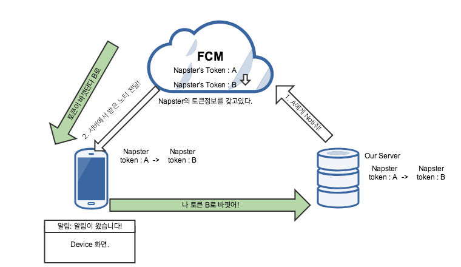

# Firebase Cloud Messaging(FCM)
> Date: 2018.4.20

### FCM그래서 뭘까?
앱에 노티를 주고 싶거나, 특정 상대에게 메세지(노티)를 주고싶을때 사용하는 기술이다. Firebase
클라우드 메시징, 안드로이드만 쓰려했던게 GCM이었다. iOS와 함께 쓰기위해 FCM으로 통합시키게되었다.
원래 서버에서 푸시를 보내는게 당연한데, 웹상에서 콘솔로 보낼 수 있께 되어있다. 그리고 GCM(Google Cloud Messaging)이 FCM으로 통합되면서 iOS에서 사용하는 포그라운드, 백그라운드 앱의 Life cycle에 따른 처리를 안드로이드에서도 동일한 형태로 처리하게 바뀌었다는것이 특징이다. 즉 포그라운드, 백그라운드 일때 처리를 따로 해줘야한다. 

FCM은 어떻게 동작하고, 어떤 옵션으로 전송이되는지, 가끔 돌발상황이 생기는데 어떻게 처리하는지 알아보자.

### FCM 동작

동작은 굉장히 간단하다. FCM을 사용하는 서버가 노티(알림)를 보내고싶은 디바이스 정보를 FCM에게 보내주면 FCM은 자동적으로 그 디바이스에게 알림을 주게되어있다. 보통 디바이스 정보를 알고 있어야하는데 특정 디바이스 정보는 Token의 형태로 저장이된다.(이토큰을 구글에서 비밀로 유지하는게 좋다고 이야기한다.) 
다음의 그림을 보자. 

1. 우리의 서버는 디바이스 Napster에게 노티를 보내고 싶어한다. 
 그렇다면 서버는 디바이스을 토큰으로 구분하는데 A라는 토큰에게 노티를 보내줘! 라고 FCM에게 요청을한다.

2. FCM은 토큰정보를 가지고있는데, A에게 서버에게 받은 알림을 전달해준다. 그러면 화면에 알림창이 뜬다!. 
(이때, 노티를 받는 앱이 사용중인지, 아닌지에 따라 처리가 위에서 이야기했던 것 처럼 약간다르다.)
----
 
* 만약 토큰이 바뀐다면? 
구글은 가끔 아주 가끔이지만 사용자 토큰을 업데이트할때가 있다. 앱자체가 업데이트됬다던지, Google Play Store 자체가 업데이트된다는지 말이다. (iOS는 앱스토어가 업데이트 될때 바뀌는지는 모르겠다.) 그럴때 어떻게 동작을할까?

1. FCM은 Napster에게 "너의 토큰은 A에서 -> B로 바꼇어!" 라고 Napster의 앱에게 알려준다. 그러면 Napster앱은
2. 우리 서버에게 친절하게 "나의 토큰이 바꼇으니 서버에서 내정보를 갱신해줘" 라고 알려준다. 
(이렇게하지 않으면 FCM에서 바뀐 토큰정보 때문에 우리서버가 A에게 노티를 아무리 주고 싶어도 FCM은 B라는 토큰정보밖에 모르니 무시해버린다... FCM에서는 서버에게 바뀐 토큰을 보내주는 로직은 없어서 이부분은 직접 앱에서 구현해줘야한다.)

# ForeGround? & BackGround
아이폰에는 앱의 상태에 따라 호출되는 함수가 존재한다. 그래서 노티를 받을때 내가 앱을 실행 중인지(Foreground), 코드는 실행중이지만 내가 사용중이 아닐때 즉 Suspended되기전 상태 Background일때 노티를 받는게 달라진다.
 
그렇다면 앱의 상태(Foreground, Background)에 따라 노티를 따로 처리하는게 왜 필요할까? 

그건 사용자 경험에 있어서 중요하다. 물론 앱을 어떻게 기획하고 사용할지에 따라 다르겠지만, 사용자가 이앱이 좀더 
신경써서만든 앱이라는 것을 알려주고 싶은 마음에 사용하기도 한다. 예를 들면 이런거다. 

 
앱이 Background상태일때, 노티가 왔다. 그 노티는 앱의 특정 화면을 보여주는 딥링크를 가지고 있다면, 백그라운드 일때 노티가 뜨면 사용자는 그 노티를 누르게된다. 그 노티를 눌렀을때, 노티에 관련된 화면으로 옮겨간다면 사용자에게 좋은 사용감을 느끼게 해줄 수 있다. 물론 많은 앱들이 이렇게 이미 설계가 되어있지만, 그렇지 않은 앱들도 존재한다. 그리고 Foreground일때 노티를 사용자가 받으면(꼭 알림의 형태가아닌 화면에 뷰를 띄어 알림을 주는 형태도있다.) 선택적으로 사용자가 노티를 누르고 화면을 이동할지 정할 수 있다. 만약 Foreground, Background상태일때는 나누지 않고 개발하게 된다고하자, 그리고 만약 새로운 노티가 딥링크로 화면을 전환시킨다면. Background일때 노티를 받아 동작하는것은 이질감이 없지만, Foreground일때 노티가온다면 바로 화면이 이동되어 이질감을 느낄 수 있는 요지가있다. 

 
따라서 앞으로 iOS에서 FCM를 받으면 어떻게 나누어서 처리를 하는지 또 딥링크를 받았을때 일일이 딥링크를 나누어서 화면을 뿌리는게 아닌 좀더 자동화된(AirBnB의 DeepLinkDispatch) 라이브러리는 없는지 알아보고 사용해보아야겠다.

iOS딥링크 오픈소스? 리서치.

빅쿼리 BigQuery